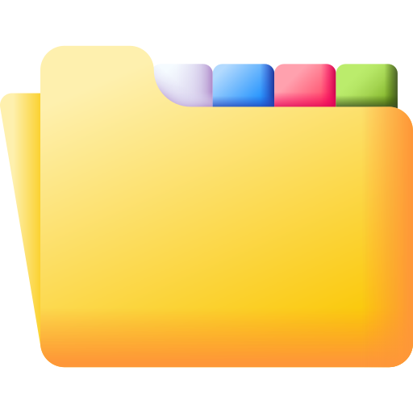

<p align="center">
  
</p>

<h1 align="center">Open Content Desk</h1>

<p align="center">
  <strong>Catch the spark. Ship the post. Never start from a blank page.</strong>
</p>

<p align="center">
  Text a half-formed idea to your agent from anywhere.<br />
  It lands on your board, filed in the right place, for the right people —
  <br />and turns into a real X thread, Reddit post, or newsletter, drafted from your own notes.
</p>

<p align="center">
  <a href="https://lemma.work/import/github/wineforyourplate/open-content-desk">
    
  </a>
</p>

<p align="center">
  <a href="#install-and-remix-">Install</a>
  ·
  <a href="#how-open-content-desk-works">Explore the pod</a>
  ·
  <a href="#make-it-yours">Remix it</a>
</p>

---

## One board. Every front door.

Capture an idea where it finds you. Shape it at your desk when you're ready to write.

<table>
  <tr>
    <td align="center" width="33%">
      
      <br /><sub><strong>Web app</strong></sub>
    </td>
    <td align="center" width="33%">
      
      <br /><sub><strong>WhatsApp</strong></sub>
    </td>
    <td align="center" width="33%">
      
      <br /><sub><strong>Email</strong></sub>
    </td>
  </tr>
</table>

<p align="center">
  <sub>The web app ships with the pod. WhatsApp and email are added after install — see <a href="#optional-front-doors">Optional front doors</a>.</sub>
</p>

## The spark dies before the draft does

Good post ideas show up mid-meeting, mid-walk, mid-anything — and then die in a notes app
you never reopen. When you finally sit down to write, you rebuild your context from scratch:
who it's for, what you can claim, how you sound.

Open Content Desk keeps the idea and the context in one place.

1. **Catch it from anywhere.** Fire a thought at Rocky on WhatsApp, by email, or on the
   desk. It's saved as a **Spark** before your attention moves on. No folder, no form.
2. **It files itself.** Rocky titles it, tags the product, drops it into the right campaign,
   and clusters it with similar ideas you've already saved.
3. **Shape it, natively.** Open the post and the Writer drafts a real X thread (tweet by
   tweet), a Reddit post (title + body), or a newsletter — grounded in your profile,
   product docs, and voice, not generic copy.
4. **One idea, every platform.** Keep one version per platform side by side. Each version
   branches from your original, so the X thread never leaks into the Reddit post.
5. **You ship it.** Posts move **Spark → Refining → Ready → Live**. Agents suggest, draft,
   and claim-check. They never publish.

## Three agents, one desk

| Agent | Job |
| --- | --- |
| **Rocky** | Board manager. Captures ideas, clusters related ones, answers *"what have I saved about X?"* from your notes. Never drafts. |
| **Writer** | Drafts, rewrites, offers perspectives, and claim-checks against your own facts. Loads the format guide and your voice before writing. |
| **Milo** | Concise chat operator. Captures, finds, organizes, shapes, and plans what to publish next. Shares to Commons only when you explicitly ask. |

## Share deliberately, with Commons

Your board is private. **Commons** is a separate set of shared boards for your team or a
client. Share a post — all its versions, or just one — or a whole campaign with its linked
posts, and everyone on that board sees it. Nothing leaves your private board unless you
send it.

## Private before clever

- Posts, campaigns, and products use row-level security — every member sees only their own.
- Commons boards are opt-in: a note is shared only when someone explicitly shares it.
- Images and documents you attach live under your own `/me` folder.
- Agents and functions get only the named tables and folders they need.
- Agents never publish and never set a post live.
- This public repository contains no personal posts, records, credentials, tokens, or
  connector accounts.

## Install and Remix 🪄

<p>
  <a href="https://lemma.work/import/github/wineforyourplate/open-content-desk">
    
  </a>
</p>

The button opens Lemma's import flow for this exact repository:

```text
https://lemma.work/import/github/wineforyourplate/open-content-desk
```

After import, run the bootstrap script once from a clone of this repo. It finishes the
parts the frontend import leaves undone: creates the folders, uploads the writing guides
and voice profiles, restores the agents' and functions' permissions, and builds and
deploys `ocd-board`:

```bash
git clone https://github.com/wineforyourplate/open-content-desk.git && cd open-content-desk
bash scripts/bootstrap-files.sh --pod <pod-id>
```

It needs an authenticated Lemma CLI, `python3`, and Node.js with npm. It is safe to re-run.

Then add a `context_profile` row — who you are, what you sell, who you write for — so
the Writer has something to ground drafts in. `payloads/context-profile.seed.json` is a
starting point:

```bash
lemma --pod <pod-id> records create context_profile --file payloads/context-profile.seed.json
```

Open `ocd-board`, capture one real idea, and turn it into a thread.

<details>
<summary><strong>Install from the command line</strong></summary>

You need an authenticated Lemma CLI.

```bash
git clone https://github.com/wineforyourplate/open-content-desk.git
cd open-content-desk

lemma pods create "Open Content Desk" --org <org-id>
lemma --pod <pod-id> pods import . --dry-run
lemma --pod <pod-id> pods import . --with-files

lemma --pod <pod-id> apps open ocd-board
```

App URL slugs are variables in `pod.json` (`ocd_board_slug`, `campaign_workspace_slug`,
`ai_at_work_slug`). Pass `--var ocd_board_slug=<slug>` if a default is taken.

</details>

### Optional front doors

WhatsApp and email are not part of the import: Lemma's system WhatsApp and email
credentials can serve only one pod per organisation, and connector accounts are
environment-specific. Add them after install, pointed at Rocky:

```bash
lemma --pod <pod-id> surfaces upsert WHATSAPP --agent rocky --credential-mode SYSTEM --enabled
lemma --pod <pod-id> surfaces upsert RESEND --agent rocky --credential-mode SYSTEM --enabled
```

If another pod in the organisation already uses the system credentials, delete that
surface first (`lemma --pod <other-pod> surfaces delete WHATSAPP`) or use
`--credential-mode CUSTOM` with your own account.

## How Open Content Desk works

```text
you send a rough idea (WhatsApp · email · desk)
            │
            ▼
        Rocky ── titles it, picks product + campaign
            │   ── searches /notes for similar ideas
            ▼
   save_post ── writes the posts row (stage: spark)
            │  ── mirrors it to /notes/<id>.md  (searchable memory)
            ▼
      appears on your board
            │
            ▼
   open it → Writer drafts per format
            │   ── loads /guides/skill_<format>.md + /voices
            │   ── grounds in context_profile + product docs
            ▼
   one version per platform  (X thread · Reddit · newsletter)
            │
            ▼
   Spark → Refining → Ready → Live   ── you approve, you publish
            │
            └──▶ share to a Commons board (optional, explicit)
```

This repository is the complete Lemma pod, not just an app:

| Layer | What ships |
| --- | --- |
| Apps | `ocd-board` (board, editor, calendar, Commons — full React source), `campaign-workspace`, and `ai-at-work`, a sample published article |
| Agents | `rocky` for capture and recall, `writer` for drafting, `milo` for chat and planning |
| Tables | Private posts, campaigns, products, and profile; shared Commons boards, members, and notes |
| Functions | `save_post` (the one write path that keeps `/notes` in sync) plus draft and claim-check helpers |
| Files | Per-format writing guides (`/guides`) and voice profiles (`/voices`); `/notes` and `/product-docs` are created empty |

The important design choice: **every post is also a searchable note.** `save_post` and the
app both mirror a post to `/notes/<id>.md`, with one section per platform version, so
"what have I said about pricing?" is a single search, not a database query.

## Make it yours

1. [Fork this repository](https://github.com/wineforyourplate/open-content-desk/fork).
2. Change the agent instructions, writing guides, voices, tables, or app.
3. Import your fork at
   `https://lemma.work/import/github/<your-github-name>/<your-repo>`.
4. Keep private records, connector accounts, member IDs, and credentials out of Git.

Useful places to start:

- `agents/rocky/instruction.md` — capture, clustering, and recall behaviour.
- `agents/writer/instruction.md` — drafting, rewriting, and claim-check rules.
- `agents/milo/instruction.md` — chat operator and Commons sharing rules.
- `files/guides/` — one writing guide per format (`skill_x_thread.md`, `skill_reddit.md`, …).
- `files/voices/` — reusable voice profiles.
- `functions/save_post/` — the server-side write path and note mirror.
- `apps/ocd-board/source/` — the complete React app (`src/formats.ts` holds the format registry).

## Verify your remix

```bash
cd apps/ocd-board/source
npm ci
npm run build

cd ../../..
lemma --pod <pod-id> pods import . --dry-run
lemma --pod <pod-id> pods doctor
```

## Share Open Content Desk

<p>
  <a href="https://twitter.com/intent/tweet?text=Open%20Content%20Desk%3A%20catch%20the%20spark%2C%20ship%20the%20post.&amp;url=https%3A%2F%2Fgithub.com%2Fwineforyourplate%2Fopen-content-desk">
    
  </a>
  <a href="https://www.linkedin.com/sharing/share-offsite/?url=https%3A%2F%2Fgithub.com%2Fwineforyourplate%2Fopen-content-desk">
    
  </a>
</p>

---

<p align="center">
  <strong>Send the spark. The desk handles the rest.</strong>
</p>
